QC INTERN TAKE-HOME

OptiSigns

Full name: Thái dương sơn

Date: 9/13/2026

Actual hours spent: 6h

Not completed: none


## PART 1 — Product exploration

### Session 1

- Charter: Khám phá việc quản lý content, đặc biệt là Folder và Asset, để tìm các vấn đề về validation, deletion và dependency handling có thể gây nhầm lẫn cho người dùng hoặc làm thay đổi content ngoài ý muốn.

- Paths taken: Tạo các Folder test; upload một image; rename và search Asset; thử tạo Folder trùng tên và tên chỉ có khoảng trắng; thử rename một Folder thành tên đã tồn tại; thêm Asset vào Playlist rồi xóa Asset nguồn.

- What I saw: Hệ thống chặn việc tạo Folder trùng tên và tên chỉ có khoảng trắng. Rename Folder thành tên trùng cũng bị chặn nhưng chỉ hiện lỗi chung chung. Khi xóa Asset đang được Playlist sử dụng, hệ thống không hiển thị rõ dependency với Playlist.

### Session 2

- Charter: Khám phá các giá trị biên của Playlist item duration và xem hệ thống xử lý các giá trị thấp hơn mức minimum có vẻ được áp dụng như thế nào.

- Paths taken: Tạo QC_Test_Playlist; thêm một image; chỉnh duration; thử các giá trị dưới 4 giây gồm 0 và 3; quan sát duration sau khi hệ thống lưu/hiển thị.

- What I saw: Giá trị 0 và 3 đều được đổi thành 4 giây. UI không giải thích rõ minimum này, vì vậy finding vẫn được phân loại UNSURE khi chưa có product specification xác nhận rule mong muốn.

### Session 3

- Charter: Khám phá Schedules và các behavior liên quan đến validation/search, tập trung vào duplicate name, destructive action và event creation.

- Paths taken: Tạo QC_Test_Schedule hai lần với cùng một tên; kiểm tra delete confirmation; mở Add Event; thử Save event khi chưa chọn Asset.

- What I saw: Hai Schedule cùng tên được tạo mà không có warning và không thể phân biệt trong sidebar. Delete confirmation chỉ hiển thị tên giống nhau. Trong Add Event, Save vẫn có vẻ enabled khi chưa chọn Asset; validation chỉ xuất hiện sau khi bấm Save.

### BUG-01

- Title: Rename một Folder thành tên đã tồn tại bị chặn nhưng error message không giải thích nguyên nhân là duplicate name

- Group: UX

- Severity: Minor

- Environment: Chrome 152, Windows 10, 2026-09-13, OptiSigns trial account

- Steps:

  1. Tạo hai Folder tên QC_Test_Folder và QC_Second_Folder.

  2. Mở Rename cho QC_Second_Folder.

  3. Nhập QC_Test_Folder và bấm Save.

- Actual: Rename bị chặn và tên Folder ban đầu vẫn được giữ, nhưng UI chỉ hiển thị error chung “Failed to rename folder”.

- Expected: Rename vẫn nên bị chặn, nhưng message cần giải thích nguyên nhân, ví dụ Folder cùng tên đã tồn tại. Khi tạo Folder trùng tên, hệ thống đã hiển thị message cụ thể hơn.

- Evidence: BUG-01.png

- Reproduced: 1/1

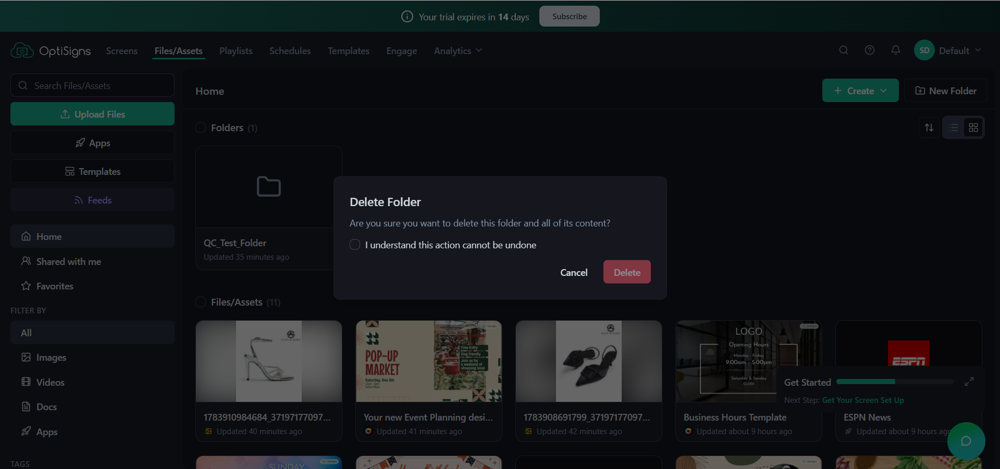


### BUG-02

- Title: Xóa Asset đang được Playlist sử dụng không có dependency warning trước khi Playlist item biến mất

- Group: UX

- Severity: Major

- Environment: Chrome 152, Windows 10, 2026-09-13, OptiSigns trial account

- Steps:

  1. Thêm một test image Asset vào QC_Test_Playlist.

  2. Từ Files/Assets, xóa chính Asset đó.

  3. Confirm deletion rồi mở lại QC_Test_Playlist.

- Actual: Delete flow yêu cầu confirmation nhưng không nói rõ Asset đang được Playlist sử dụng. Sau khi xóa, item đó không còn trong Playlist.

- Expected: Trước khi xóa content đang được Playlist tham chiếu, confirmation nên hiển thị dependency hoặc giải thích rõ ảnh hưởng đến Playlist để người dùng hiểu hậu quả trước khi thực hiện destructive action.

- Evidence: BUG-02-1.png, BUG-02-2.png

- Reproduced: 1/1

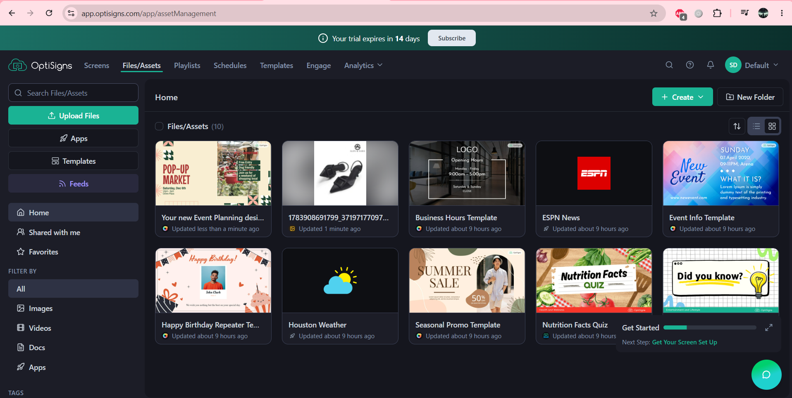


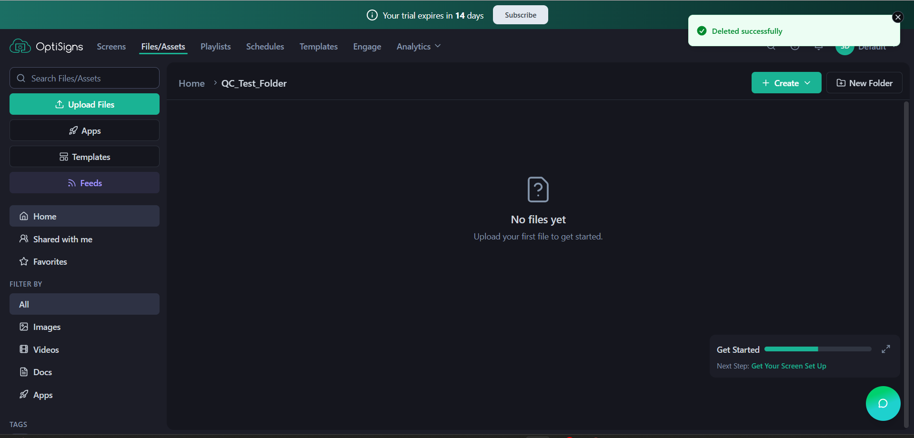


### BUG-03

- Title: Playlist duration dưới 4 giây bị tự động đổi thành 4 giây mà không giải thích rõ boundary

- Group: UNSURE

- Severity: Minor

- Environment: Chrome 152, Windows 10, 2026-09-13, OptiSigns trial account

- Steps:

  1. Thêm một image Asset vào QC_Test_Playlist.

  2. Chỉnh duration và nhập 0.

  3. Quan sát kết quả, sau đó thử lại với 3.

- Actual: Cả 0 và 3 đều được hiển thị thành duration 4 giây.

- Expected: UNSURE. Nếu 4 giây là minimum được thiết kế, UI nên thông báo supported range hoặc validation rule. Để phân loại finding này là BUG, cần OptiSigns specification/help page xác định minimum duration và validation behavior mong muốn.

- Evidence: BUG-03.png

- Reproduced: 0 -> 4 quan sát 1 lần; 3 -> 4 quan sát 1 lần

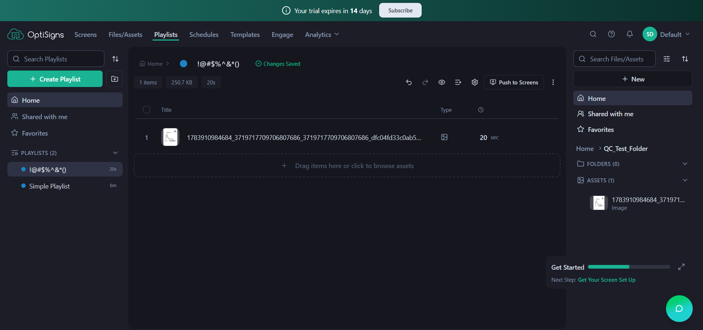


### BUG-04

- Title: Tạo Schedule với tên đã tồn tại tạo ra duplicate khó phân biệt mà không có warning

- Group: UX

- Severity: Minor

- Environment: Chrome 152, Windows 10, 2026-09-13, OptiSigns trial account

- Steps:

  1. Tạo một Schedule tên QC_Test_Schedule.

  2. Tạo thêm một Schedule khác với chính xác cùng tên.

  3. Quan sát Schedules list/sidebar.

- Actual: Schedule thứ hai được tạo thành công. Hai entry tên QC_Test_Schedule xuất hiện mà không có thông tin rõ ràng để phân biệt.

- Expected: Product nên warning về duplicate name hoặc cung cấp đủ thông tin để phân biệt các Schedule cùng tên, đặc biệt trước các action sau đó như Delete.

- Evidence: BUG-04-1.png, BUG-04-2.png

- Reproduced: 1/1

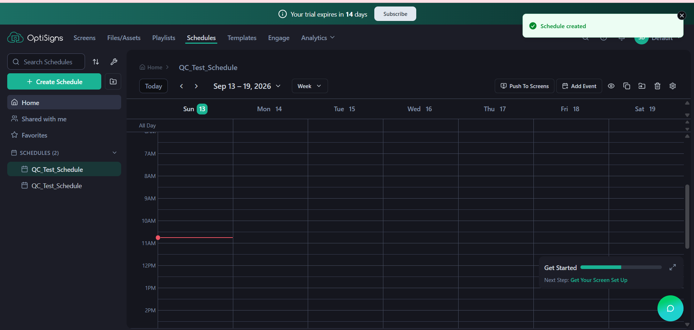


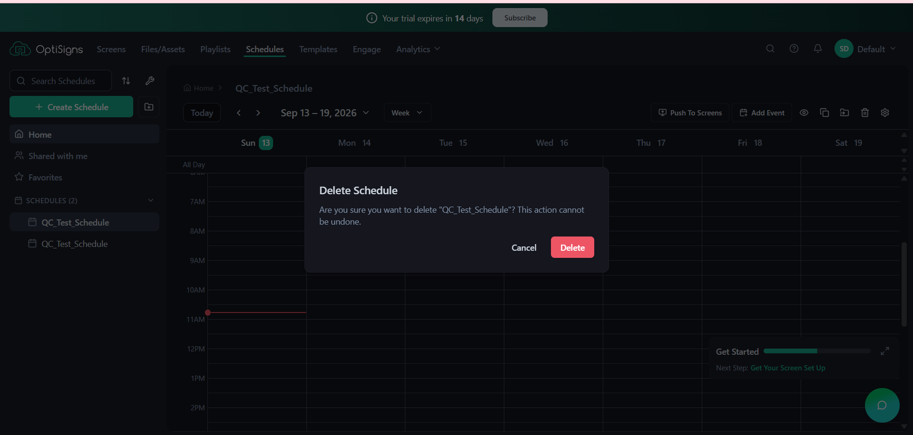


### BUG-05

- Title: Add Event vẫn để Save enabled khi required Asset còn trống, validation chỉ xuất hiện sau khi submit

- Group: UX

- Severity: Minor

- Environment: Chrome 152, Windows 10, 2026-09-13, OptiSigns trial account

- Steps:

  1. Mở một Schedule và bấm Add Event.

  2. Để Asset ở trạng thái “No asset selected”.

  3. Bấm Save.

- Actual: Save vẫn có vẻ enabled dù required Asset còn trống. Chỉ sau khi bấm Save, form mới hiển thị “Please select an asset”.

- Expected: Vì Asset là required field, form nên làm rõ requirement trước khi submit; tốt hơn là Save disabled cho đến khi có đủ required input, hoặc required state được hiển thị rõ ngay từ đầu.

- Evidence: BUG-05-1.png, BUG-05-2.png

- Reproduced: 1/1

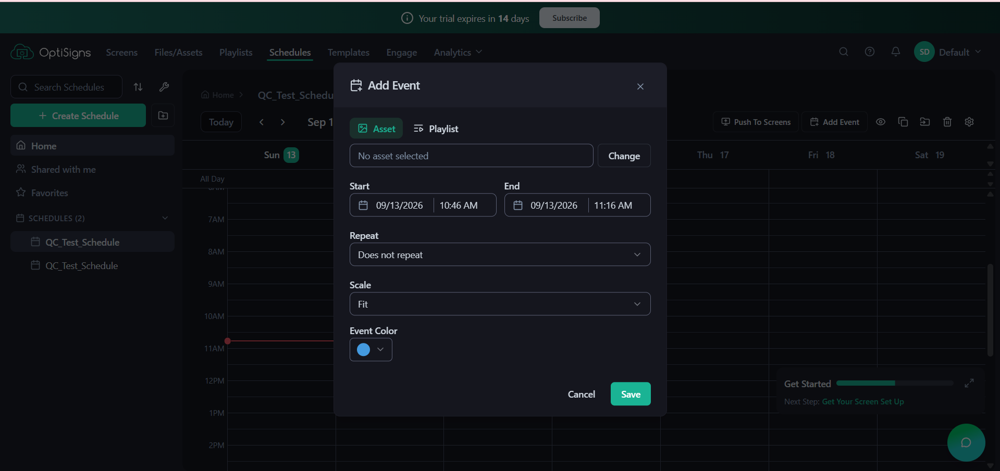


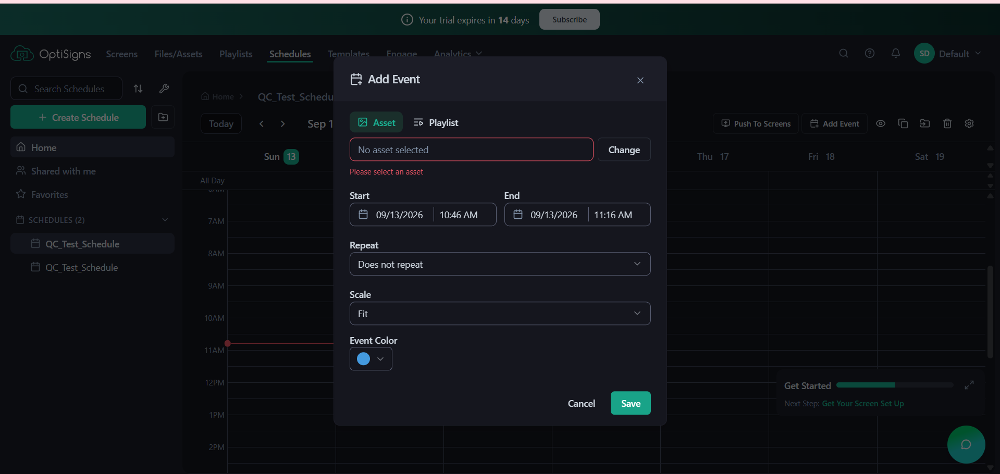


## PART 2 — Test cases for Playlist

Phạm vi: tạo và chỉnh sửa Playlist, thứ tự content item, play duration, tìm kiếm, xóa và assign Playlist tới Screen.

| ID | Description | Precondition | Steps | Expected result | Priority | Type |
| --- | --- | --- | --- | --- | --- | --- |
| PL-01 | Create Playlist với tên hợp lệ | User đã đăng nhập và có quyền quản lý Playlist | 1. Mở Playlists.<br>2. Chọn Create Playlist.<br>3. Nhập một tên hợp lệ.<br>4. Chọn Create. | Playlist mới được tạo thành công, xuất hiện trong danh sách và hiển thị đúng tên đã nhập. | P1 | Functional |
| PL-02 | Add Asset vào Playlist và kiểm tra dữ liệu được lưu | Đã có Playlist và ít nhất một Asset hợp lệ | 1. Mở Playlist.<br>2. Add/drag một Asset vào Playlist.<br>3. Chờ Changes Saved.<br>4. Mở lại Playlist. | Asset xuất hiện trong Playlist và vẫn còn sau khi mở lại. | P0 | Functional |
| PL-03 | Thay đổi thứ tự nhiều content item và kiểm tra thứ tự được giữ | Playlist tồn tại và có ít nhất 3 Asset | 1. Add Asset A, B, C.<br>2. Reorder thành C, A, B.<br>3. Chờ lưu.<br>4. Mở lại Playlist. | Playlist vẫn giữ chính xác thứ tự C, A, B sau khi mở lại. | P0 | Functional |
| PL-04 | Chỉnh play duration hợp lệ cho một item | Playlist có ít nhất một content item | 1. Mở duration của item.<br>2. Nhập 20 giây.<br>3. Save/chờ Changes Saved.<br>4. Mở lại Playlist. | Duration được lưu là 20 giây và hiển thị đúng sau khi mở lại. | P1 | Functional |
| PL-05 | Nhập duration thấp hơn minimum quan sát được | Playlist có một image item | 1. Chọn duration.<br>2. Nhập 3 giây.<br>3. Rời khỏi field/Save.<br>4. Quan sát giá trị sau xử lý. | Nếu 3 giây không được hỗ trợ, hệ thống nên từ chối rõ ràng hoặc thông báo minimum/range thay vì âm thầm đổi input của user. | P1 | Edge / Negative |
| PL-06 | Tạo Playlist với name rỗng | User có quyền Create Playlist | 1. Chọn Create Playlist.<br>2. Để Playlist name trống.<br>3. Thử Create. | Hệ thống không tạo Playlist và hiển thị validation rõ ràng cho required field. | P1 | Negative |
| PL-07 | Dùng special characters trong Playlist name | User có quyền Create/Rename Playlist | 1. Tạo hoặc Rename Playlist thành !@#$%^&*().<br>2. Save.<br>3. Search và mở lại Playlist. | Nếu special characters được hỗ trợ, tên phải được giữ nguyên và Playlist vẫn Search/open được; nếu không hỗ trợ, hệ thống phải hiển thị validation rõ ràng. | P2 | Edge |
| PL-08 | Rename Playlist và kiểm tra tên mới được persist | Đã có một Playlist | 1. Mở Rename Playlist.<br>2. Nhập một tên mới hợp lệ.<br>3. Chọn Save.<br>4. Navigate sang trang khác rồi quay lại. | Tên mới được lưu và hiển thị nhất quán ở Playlist list và header. | P1 | Functional |
| PL-09 | Cancel khi đang Rename Playlist | Đã có một Playlist | 1. Mở Rename Playlist.<br>2. Đổi tên thành SHOULD_NOT_SAVE.<br>3. Chọn Cancel hoặc đóng modal.<br>4. Kiểm tra lại Playlist. | Tên cũ vẫn được giữ và giá trị chưa Save bị loại bỏ. | P1 | Negative |
| PL-10 | Delete Playlist có confirmation | Có một Playlist dùng để test và có thể xóa | 1. Mở Playlist.<br>2. Chọn Delete.<br>3. Confirm deletion.<br>4. Search Playlist vừa xóa. | Playlist bị xóa và không còn xuất hiện hoặc mở được từ danh sách/Search. | P1 | Functional |
| PL-11 | Assign Playlist tới một hoặc nhiều Screens | Có Playlist hợp lệ và ít nhất một Screen khả dụng | 1. Mở Playlist.<br>2. Chọn Push to Screens.<br>3. Chọn một hoặc nhiều Screens.<br>4. Confirm. | Screen được chọn nhận đúng Playlist và trạng thái assignment được phản ánh chính xác trên portal. | P0 | Integration |
| PL-12 | Search Playlist bằng exact name và partial name | Có ít nhất một Playlist với tên đã biết | 1. Search bằng exact Playlist name.<br>2. Clear Search.<br>3. Search bằng một substring đặc trưng trong tên. | Playlist mong đợi được trả về với cách matching được hỗ trợ và các Playlist không liên quan được filter ra. | P2 | Functional |
| PL-13 | Search một Playlist không tồn tại | Có ít nhất một Playlist trong account | 1. Search ZZZ_NOT_EXIST_987654.<br>2. Quan sát result state.<br>3. Clear Search. | Hệ thống hiển thị trạng thái No results rõ ràng; sau khi Clear Search, danh sách Playlist bình thường được khôi phục. | P2 | Negative |
| PL-14 | Delete source Asset đang được sử dụng trong Playlist | Playlist đang chứa một Asset có thể xóa từ Files/Assets | 1. Xác nhận Asset đang nằm trong Playlist.<br>2. Sang Files/Assets và Delete Asset đó.<br>3. Confirm deletion.<br>4. Mở lại Playlist. | Trước destructive deletion, hệ thống nên cảnh báo rõ dependency với Playlist và ảnh hưởng của việc xóa; Playlist bị ảnh hưởng phải được xử lý theo cách có thể dự đoán. | P1 | Integration / Negative |
| PL-15 | Navigate khỏi Playlist ngay sau khi có thay đổi | Playlist tồn tại và user có thể chỉnh sửa content | 1. Add hoặc reorder một item.<br>2. Ngay lập tức navigate sang section khác.<br>3. Quay lại Playlist. | Nếu thay đổi đã Save thì dữ liệu phải persist. Nếu Save còn pending, hệ thống nên chặn navigation hoặc cảnh báo để tránh mất thay đổi âm thầm. | P1 | Reliability / Edge |

### Why those three are P0 (100–150 words)

Mình đánh dấu PL-02, PL-03 và PL-11 là P0 vì nếu một trong ba luồng này hỏng, mục tiêu cốt lõi của Playlist sẽ bị ảnh hưởng trực tiếp. Khách hàng phải có khả năng đưa content vào Playlist, tin rằng content sẽ phát đúng thứ tự đã cấu hình và cuối cùng assign Playlist đó tới đúng Screen. Nếu Add Asset thất bại, Playlist không thể được xây dựng. Nếu thứ tự item bị sai, Screen có thể phát sai menu, chương trình khuyến mãi, hướng dẫn hoặc thông tin vận hành. Nếu Push to Screens thất bại, một Playlist dù cấu hình hoàn chỉnh cũng không thể đến được người xem. Vì vậy ba case này có thể block release do hậu quả trực tiếp đối với workflow chính và nội dung khách hàng đang hiển thị, chứ không phải vì các test case này khó thực hiện.

### If you could only run five (80–120 words)

Nếu release đang gấp và chỉ đủ thời gian chạy năm case, mình chọn PL-02, PL-03, PL-04, PL-10 và PL-11. Năm case này bao phủ vòng đời chính của Playlist: Add content, giữ đúng thứ tự, lưu play duration, Delete Playlist và Push to Screens. Rủi ro mình chấp nhận là giảm coverage cho validation và các tình huống bất thường. Mình sẽ chưa trực tiếp kiểm tra empty name, special characters, duration boundary, Search, Cancel Rename, source Asset bị xóa và navigation khi Save đang pending. Do đó một số lỗi UX, validation hoặc dependency handling có thể lọt qua. Tuy nhiên năm case được chọn cho mức confidence nhanh nhất rằng workflow Playlist quan trọng nhất vẫn hoạt động end-to-end.

## PART 3 — Verifying five AI claims

Verdict sử dụng: TRUE · FALSE · CANNOT VERIFY

### AI-1


- Verdict: TRUE

- How I verified: Tôi mở Screens để kiểm tra Screen list. Account test chưa có Screen đã pair, nên tôi tiếp tục chọn Add Screen và xác nhận hệ thống yêu cầu Pair code 6 chữ số từ OptiSigns Player. Vì môi trường test chưa có Screen thực tế để quan sát nhiều trạng thái, tôi cross-check tài liệu support chính thức của OptiSigns. Tài liệu mô tả Screen được portal theo dõi trạng thái và sẽ được đánh dấu Offline khi không nhận cập nhật từ Player sau 10 phút; tài liệu hiện tại sử dụng Online/Offline cho trạng thái kết nối. Dựa trên UI hiện tại và tài liệu chính thức, tôi đánh giá claim là TRUE.

- Supporting source: OptiSigns — Why Does My Screen Show as “Offline” on the Web Portal?

- Evidence: AI-1-1.png, AI-1-2.png

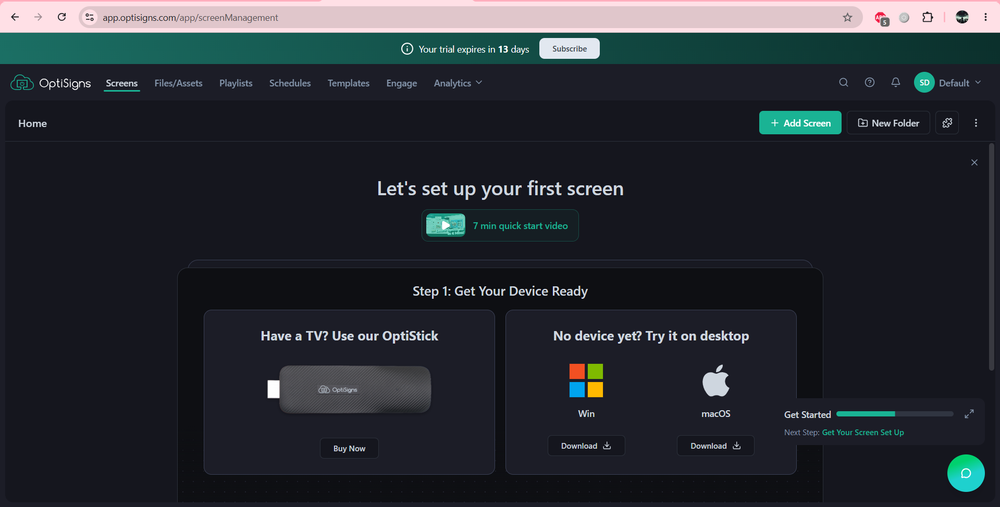


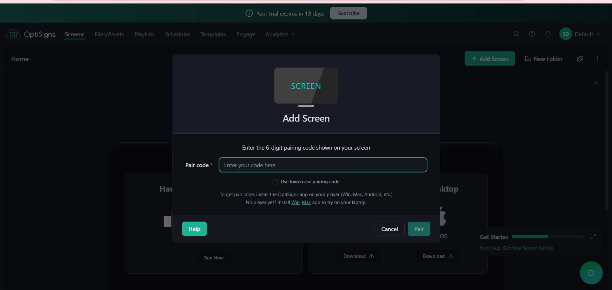


### AI-2


- Verdict: FALSE

- How I verified: Tôi mở Files/Assets và xác nhận content được quản lý trong Asset library. Sau đó tôi cross-check hướng dẫn chính thức Push Contents to your Screens. Khi một Screen đang chạy Playlist, OptiSigns cho phép add Asset vào Playlist hiện tại hoặc assign Asset trực tiếp để override nội dung đang phát. Tài liệu cũng mô tả Temp Takeover có thể quay lại previously assigned content. Điều này không phù hợp với claim rằng content cũ bị xóa khỏi account khi assign content mới. Việc thay nội dung đang phát và việc xóa Asset khỏi account là hai hành động khác nhau.

- Supporting source: OptiSigns — Push Contents to your Screens

- Evidence: AI-2.png

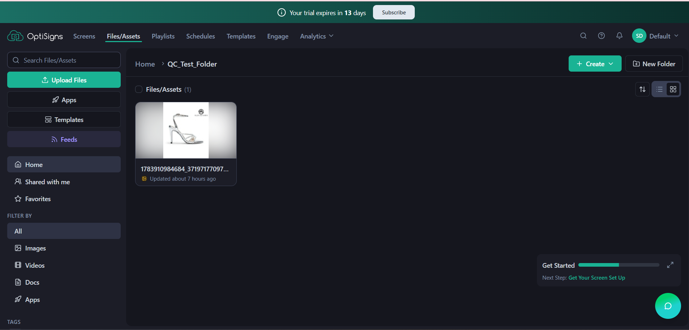


### AI-3


- Verdict: FALSE

- How I verified: Tôi không coi “20/20 test cases passed” là bằng chứng rằng Schedule không còn bug. Trong exploratory testing ở Part 1, tôi tiếp tục kiểm tra ngoài phạm vi các test case giả định và quan sát được vấn đề UX: hệ thống cho phép tạo hai Schedule cùng tên QC_Test_Schedule, khiến chúng khó phân biệt trong sidebar và khi thực hiện thao tác tiếp theo. Ngoài ra, về test methodology, test pass chỉ cho biết các case đã chạy không phát hiện failure trong phạm vi đó; nó không chứng minh không còn defect nào khác.


### AI-4


- Verdict: CANNOT VERIFY

- How I verified: Tôi mở Analytics → Proof of Play, bật Playback Report và mở date-range selector. UI có Today, Yesterday, Last 7 Days, Last 30 Days, Last 90 Days, Last Week, Last Month và custom range. Tuy nhiên, Last 90 Days chỉ cho thấy report có preset truy vấn 90 ngày; nó không chứng minh dữ liệu tự động bị xóa sau ngày thứ 90. Tôi cũng kiểm tra tài liệu Proof of Play chính thức: tài liệu mô tả việc thu thập, filter, export và schedule report, nhưng phần được kiểm tra không nêu retention policy 90 ngày.

- What I would need: Một retention policy chính thức xác nhận thời gian lưu/xóa playback data, hoặc một account có playback history cũ hơn 90 ngày để kiểm tra trực tiếp dữ liệu đó còn tồn tại hay không.

- Supporting source: OptiSigns — Advanced: Proof of Play (or Playback report)

- Evidence: AI-4.png

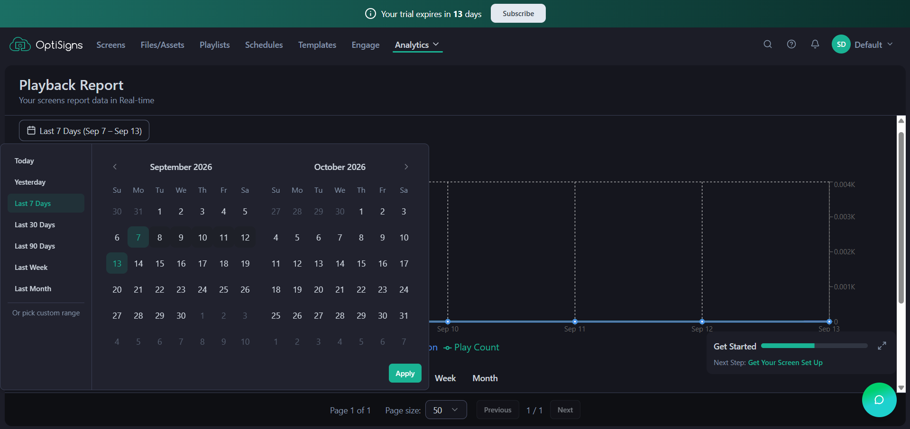


### AI-5


- Verdict: CANNOT VERIFY

- How I verified: Tôi mở Schedules → Create Schedule. Trong phiên bản đang test, form New Schedule chỉ có Schedule name và không có Timezone field. Tôi tiếp tục kiểm tra Schedule settings và Account → Preferences. Preferences có các setting chung và Playlist settings nhưng không thấy setting nào cho phép xác định Schedule đang lấy browser timezone hay Screen timezone. Vì account chưa có Screen đã pair, tôi cũng không thể tạo một controlled comparison giữa browser timezone và Screen timezone.

- What I would need: Một Screen đã pair có timezone được đặt khác với browser timezone, sau đó tạo Schedule/Event và quan sát thời gian thực tế trên Screen; hoặc tài liệu chính thức mô tả chính xác timezone behavior của Schedule.

- Evidence: AI-5-1.png, AI-5-2.png

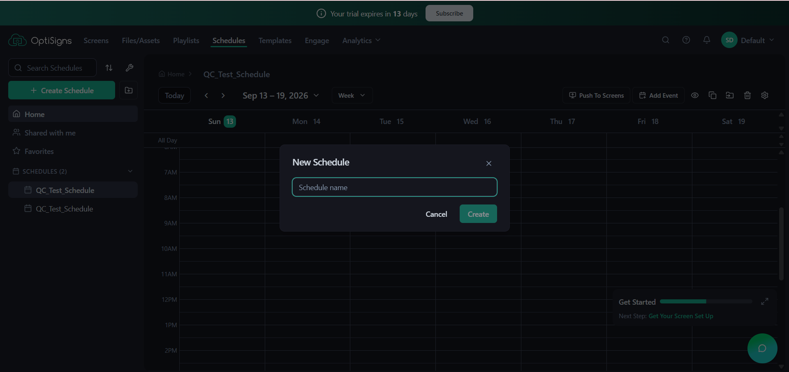


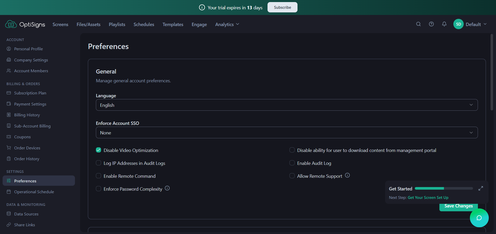


### Which claim is a different kind

AI-3. AI-1, AI-2, AI-4 và AI-5 là các factual claims về behavior của sản phẩm, nên có thể kiểm tra bằng UI, controlled experiment hoặc documentation. AI-3 sai theo một cách khác: vấn đề nằm ở logic của kết luận kiểm thử. Việc 20 test cases đều pass chỉ cho biết không phát hiện bug trong phạm vi 20 cases đó; nó không thể chứng minh Schedule feature hoàn toàn không còn bug.


## PART 4 — Slack message

```
Chào anh/chị, em phát hiện khi xóa Asset đang được sử dụng trong Playlist, hệ thống không hiển thị dependency warning; sau khi xóa, Asset cũng biến mất khỏi Playlist.

Cách tái hiện: upload một Asset → thêm Asset vào Playlist → vào Files/Assets → xóa Asset → mở lại Playlist. Asset không còn trong Playlist.

Vấn đề nên được ưu tiên kiểm tra vì người dùng có thể xóa nhầm Asset đang phát, làm thay đổi content hiển thị ngoài ý muốn. Trước khi xóa, confirmation nên nêu rõ các Playlist bị ảnh hưởng để người dùng quyết định an toàn hơn.
```
Word count: 101 words
